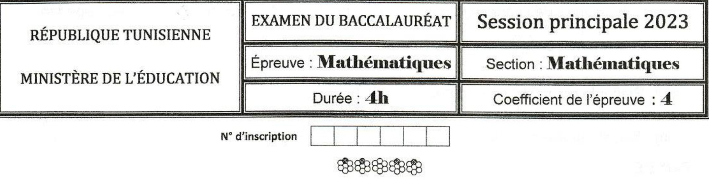

Le suiet comporte 6 pages numérotées de 1/6 à 6/6 Les pages 5/6 et 6/6 sont a rendre avec la copie.

$$
\mathrm{E x e r c i c e ~ 1 ~ ( 4. 5 ~ p o i n t s )}
$$

Le plan $\centerdot$ est rapporté a un repere orthonorme direct $( \mathrm{O, \vec{u}, \vec{v}} ).$ 

Soit $\mathsf{A},$ B et $\mathtt{C}$ les points du plan d'affixes respectives i, 1+i et -1+i.

A tout point M du plan $\mathcal{P}$ d'affixe ${\mathsf{Z}} \neq{\mathsf{i}},$ on associe le point $\mathsf{M}^{\prime}$ de $\ref{p h o t e s t a t i o n}$ d'affixe $\mathrm{Z^{1}=\frac{1 \mathrm{z}+\mathrm{z}} {\mathrm{z}}}$ 

1. Montrer que pour tout $z \neq\mathrm{i} \,, \, \bigl( \mathrm{z}-\mathrm{i} \bigr) \bigl( \mathrm{z}-\mathrm{i} \bigr)=\mathrm{I} \,.$ 

$$
2. \ \mathrm{E n ~ d e d u i r e ~ q u e ~} z^{\prime} \neq i.
$$

Soit ${\mathsf{Z}} \neq{\mathsf{i}},$ M le point d'affixe $z$ et M' le point d'affixe z'.

3. Déterminer 'ensemble des points M tel que $\mathbf{M}=\mathbf{M}^{\prime}.$ 

4. a) Montrer que les points $\mathsf{A},$ M et M' sont alignes si, et seulement si $( \mathrm{z}-\mathrm{i} )^{2}$ est réel

b) En déduire 'ensemble des points M tel que les points $\mathrm{A},$ M et M' soient alignés ${}_{5}$ Montrer que pour tout point M d'affixe ${\mathsf{Z}} \neq{\mathsf{i}},$ 

AM.AM'=1 et $\left( \overrightarrow{\mathrm{A B}} \, \widehat{, \, \mathrm{A M}} \right) \equiv\left( \overrightarrow{\mathrm{A M}} \, \widehat{, \, \mathrm{A B}} \right) \left[ 2 \pi\right]$ 

Dans la figure 1 de l'annexe jointe,

 $\zeta$ est le cercle de centre $\mathsf{A}$ et de rayon 1.

k et o sont espoints d'fixesrepctives
$$
z_{K}=\mathrm{i}+\mathrm{e}^{\mathrm{\it~ {4} ~}} \mathrm{e t} \; \; z_{Q}=\mathrm{i}+\mathrm{r} \mathrm{e}^{\mathrm{\it~ {4} ~}}, \; r >
$$

H est le point de $\zeta$ tel que le triangle AHQ est rectangle en H et E est le projete orthogonal de H sur la droite $\mathrm{( A K )}$ .

6. Soi le point $\mathsf{K}^{\prime}$ d afixe $z_{\mathrm{K}}^{\prime}$ .

a) Calculr la distance AK' et donner une mesure de $\Bigl( \overline{{\mathrm{A B}}} \;, \; \overline{{\mathrm{A K}^{\prime}}} \Bigr).$ 

b)Placer le point $\mathsf{K}^{\prime}$ sur la figure 1.

c) Déterminer 'ensemble des points M' lorsque M decrit la demi-droite AK) privée du point A. $7.$ a) Montrer que AQ . AE= 1

 $\mathrm{b )}$ outiune ors as afgure 1 point 'dafite $z_{\mathrm{Q}}^{\prime}$ .